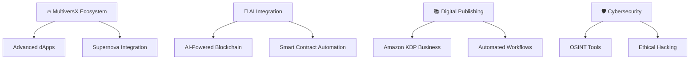

# 👋 Hello, I'm George Pricop!

[](https://github.com/Gzeu)
[](https://github.com/Gzeu)
[](https://github.com/Gzeu)
[](https://github.com/Gzeu)

<div align="center">
  
</div>

## 🚀 About Me

I'm a passionate developer focused on **blockchain** and **artificial intelligence**. I love building innovative digital products and exploring cutting-edge technologies. Specialized in **MultiversX** ecosystem development and creating automated AI solutions.

- 🔭 Currently working on **[CarbonFlow AI](https://github.com/Gzeu/carbonflow-ai)** - decentralized platform for carbon credits trading
- 🌱 Learning **MultiversX Agent Kit** and **AI-powered dApps**
- 👯 Looking to collaborate on blockchain and AI projects
- 💬 Ask me about **smart contracts**, **automation**, and **digital products**
- ⚡ Fun fact: I publish books on Amazon KDP and develop trading bots
- 🎯 2024 Goal: Launch 5 innovative dApps on MultiversX

## 🛠️ Tech Arsenal

<div align="center">

### 🔗 Blockchain & Web3


### 💻 Frontend & Backend


### 🤖 AI & Machine Learning


### ☁️ Tools & Platforms


</div>

## 🎯 Featured Projects

<div align="center">

| 🌟 Project | 📝 Description | 🛠️ Tech Stack | 🔗 Links |
|-----------|----------------|----------------|----------|
| **🌱 CarbonFlow AI** | Revolutionary AI platform for decentralized carbon credit trading with ML verification | `Python` `AI/ML` `Blockchain` | [GitHub](https://github.com/Gzeu/carbonflow-ai) |
| **🚀 MVX Portfolio Manager** | AI-powered MultiversX portfolio dashboard with agent kit integration | `TypeScript` `Next.js` `MultiversX SDK` | [GitHub](https://github.com/Gzeu/mvx-portfolio-manager) |
| **🧠 AI Wellness Assistant** | Real-time stress detection using facial micro-expressions and FACS | `Python` `OpenCV` `ML` | [GitHub](https://github.com/Gzeu/ai-wellness-assistant) |
| **🍷 MultiversX Wine dApp** | Complete wine industry app with registry, marketplace & investment pools | `Rust` `TypeScript` `MultiversX` | [GitHub](https://github.com/Gzeu/multiversx-wine-dapp) |
| **🎮 Memory Match Pro** | Professional memory game with HTML5 Canvas and particle effects | `JavaScript ES6+` `Canvas` | [GitHub](https://github.com/Gzeu/memory-match-pro) |
| **💰 ProfesorX Trader** | Professional trading dashboard for Binance with AI market analysis | `JavaScript` `Binance API` `AI` | [GitHub](https://github.com/Gzeu/profesorXtrader) |

</div>

## 📊 GitHub Analytics

<div align="center">
  


</div>

## 🏆 Achievements & Certifications

<div align="center">


</div>

## 🌟 Expertise Areas

<details>
<summary>🔗 <b>Blockchain Development</b></summary>
<br>

- 🦀 **Smart Contracts in Rust** for MultiversX ecosystem
- 🔄 **DeFi Integrations** and liquidity protocols
- 🎨 **NFT Marketplaces** and digital asset management
- 🏛️ **DAO Development** and governance systems
- 🔐 **Security Auditing** and best practices

</details>

<details>
<summary>🤖 <b>AI & Automation</b></summary>
<br>

- 💬 **Chatbots & Conversational AI** development
- 🎯 **Prompt Engineering** for optimal AI responses
- 📈 **Automated Trading Systems** with ML algorithms
- 🎨 **Content Generation** using various AI models
- 🔄 **Workflow Automation** for business processes

</details>

<details>
<summary>📱 <b>Full-Stack Development</b></summary>
<br>

- ⚛️ **React/Next.js** for modern frontend experiences
- 🟢 **Node.js Backend** with scalable architectures
- 🔌 **API Integrations** and microservices
- 📊 **Real-time Applications** with WebSockets
- 🎨 **UI/UX Design** with modern design principles

</details>

<details>
<summary>☁️ <b>DevOps & Cloud</b></summary>
<br>

- 🚀 **Vercel & Railway** deployment strategies
- 🔄 **GitHub Actions** CI/CD pipelines
- 🐳 **Docker** containerization
- 📊 **Monitoring & Analytics** implementation
- 🔒 **Security & Performance** optimization

</details>

## 📈 Current Focus Areas



## 🤝 Let's Collaborate!

I'm always interested in:

- 🚀 **Innovative blockchain projects**
- 🧠 **Creative AI solutions**
- ⚙️ **Automation opportunities**
- 🌐 **Open-source collaborations**
- 📚 **Knowledge sharing & mentoring**

## 📫 Connect With Me

<div align="center">

[](mailto:pricopgeorge@gmail.com)
[](https://github.com/Gzeu)
[](https://linkedin.com/in/george-pricop)
[](https://discord.gg/your-server)
[](https://twitter.com/GeorgePricop)

</div>

---

## 🎮 Interactive Profile Game

<div align="center">

### 🎯 **Developer Quest: Collect All Badges!**

*Click on the badges below to reveal hidden achievements and unlock special content!*

<details>
<summary>🏅 <b>Achievement Hunter</b> - Click to reveal your progress!</summary>
<br>

```
🎮 DEVELOPER QUEST PROGRESS

┌─────────────────────────────────────────────┐
│  🏆 ACHIEVEMENTS UNLOCKED                   │
├─────────────────────────────────────────────┤
│  ✅ First Repository Creator               │
│  ✅ Code Commit Streak Master              │
│  ✅ Open Source Contributor                │
│  ✅ AI Integration Specialist              │
│  ✅ Blockchain Pioneer                     │
│  ✅ Full-Stack Developer                   │
│  🔒 Secret Achievement (Keep coding!)      │
│  🔒 Mystery Badge (100+ stars needed)      │
│  🔒 Legend Status (Coming soon...)         │
└─────────────────────────────────────────────┘

    📊 STATS
    ├─ Repositories: Loading...
    ├─ Total Stars: ⭐ Counting...
    ├─ Code Lines: 💻 Infinite
    └─ Coffee Cups: ☕ 99999+

    🎯 NEXT MILESTONE
    └─ Unlock "Community Leader" badge
       Progress: ████████░░ 80%
```

</details>

<details>
<summary>🎲 <b>Random Developer Fact</b> - Click for a surprise!</summary>
<br>

```
🎭 RANDOM DEVELOPER FACT GENERATOR

╔══════════════════════════════════════════════╗
║  🤔 Did you know?                            ║
║                                              ║
║  The first computer "bug" was an actual     ║
║  bug - a moth found trapped in a Harvard    ║
║  Mark II computer in 1947 by Grace Hopper!  ║
║                                              ║
║  🐛 Bug Report: "Moth in relay"             ║
║  📅 Date: September 9, 1947                  ║
║  🏛️ Location: Harvard University             ║
╚══════════════════════════════════════════════╝

    🎯 Your coding fact for today:
    "Every expert was once a beginner. Every pro 
     was once an amateur. Every icon was once an 
     unknown." - Robin Sharma
```

</details>

<details>
<summary>🎵 <b>Coding Playlist</b> - Music that powers my code!</summary>
<br>

```
🎧 GEORGE'S CODING SOUNDTRACK

♪ Now Playing: "Algorithm Dreams" ♪

┌─────────────────────────────────────────────┐
│  🎵 TOP CODING TRACKS                      │
├─────────────────────────────────────────────┤
│  01. ▶️  Synthwave - "Neon Coding"          │
│  02. ⏸️  Lo-Fi Hip Hop - "Focus Mode"       │
│  03. 🔄  Epic Orchestral - "Deploy Day"     │
│  04. ⏭️  Chillstep - "Debug Sessions"       │
│  05. 🎯  Jazz - "Late Night Commits"        │
│  06. 🚀  EDM - "Feature Release"            │
│  07. 🌙  Ambient - "Code Review"            │
│  08. ⚡  Rock - "Breaking Production"       │
└─────────────────────────────────────────────┘

    🎼 Mood: [ Productive ] [ Focused ] [ Caffeinated ]
    🎵 Volume: ████████████████████ 100%
    ⏰ Session: 4h 23m (and counting...)
```

</details>

<details>
<summary>🎮 <b>Code Adventure RPG</b> - Your developer journey!</summary>
<br>

```
⚔️  CODE ADVENTURE RPG ⚔️

👤 PLAYER: George "Gzeu" Pricop
🏆 LEVEL: Senior Developer (Level 42)

┌─────────────────────────────────────────────┐
│  📊 CHARACTER STATS                        │
├─────────────────────────────────────────────┤
│  💪 Coding Power      ████████████░  92/100 │
│  🧠 Problem Solving   ████████████░  95/100 │
│  ⚡ Learning Speed    ██████████░░  85/100 │
│  🤝 Collaboration     ████████░░░░  75/100 │
│  ☕ Caffeine Tolerance ████████████ 100/100 │
└─────────────────────────────────────────────┘

🎒 INVENTORY:
├─ 🔧 TypeScript Mastery Scroll
├─ 🦀 Rust Programming Grimoire  
├─ 🤖 AI Integration Toolkit
├─ 🔗 Blockchain Developer Badge
└─ ☕ Unlimited Coffee Potion

🌟 RECENT ACHIEVEMENTS:
├─ Deployed 5 dApps on MultiversX
├─ Created AI-powered trading bot
├─ Published 3 Amazon KDP books
└─ Mastered smart contract security

🎯 CURRENT QUEST:
"Build the ultimate DeFi protocol"
Progress: ████████░░ 80% Complete
Reward: 🏆 Blockchain Legend Status

⚔️  Ready for the next coding challenge!
```

</details>

### 🎪 **Bonus Easter Eggs**

Try these secret commands in your terminal:

```bash
# Secret developer commands (for fun!)
curl -s "https://api.github.com/users/Gzeu" | jq '.bio'
git log --oneline --graph --decorate --all
npm run build-dreams
```

</div>

---

<div align="center">
  
**"Building the future, one smart contract at a time"** 🚀


</div>