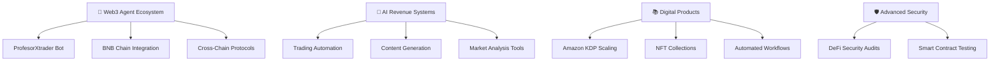

# 👋 Hello, I'm George Pricop!

[](https://github.com/Gzeu)
[](https://github.com/Gzeu)
[](https://github.com/Gzeu)
[](https://github.com/Gzeu)

<div align="center">
  
</div>

## 🚀 About Me

I'm a passionate developer focused on **blockchain** and **artificial intelligence**. I love building innovative digital products and exploring cutting-edge technologies. Specialized in **MultiversX** ecosystem development and creating automated AI solutions.

- 🔭 Currently working on **[ProfesorXtrader](https://github.com/Gzeu/profesorXtrader)** - AI-powered Web3 trading agent for BNB Chain
- 🌱 Learning **AI Revenue Optimization** and **Web3 Agent Development**
- 👯 Looking to collaborate on blockchain and AI projects
- 💬 Ask me about **smart contracts**, **automation**, **trading bots**, and **digital products**
- ⚡ Fun fact: I publish books on Amazon KDP and develop AI-powered trading systems
- 🎯 **Current Goals**: Launch ProfesorXtrader bot, build 3 new Web3 agents, scale AI revenue systems

## 🛠️ Tech Arsenal

<div align="center">

### 🔗 Blockchain & Web3


### 💻 Frontend & Backend


### 🤖 AI & Machine Learning


### ☁️ Tools & Platforms


</div>

## 🎯 Featured Projects

<div align="center">

| 🌟 Project | 📝 Description | 🛠️ Tech Stack | 🔗 Links |
|-----------|----------------|----------------|----------|
| **🤖 ProfesorXtrader** | AI-powered Web3 trading agent with BNB Chain integration and advanced market analysis | `JavaScript` `AI` `Web3` `BNB Chain` | [GitHub](https://github.com/Gzeu/profesorXtrader) |
| **📈 AI Revenue Optimizer** | Comprehensive system for optimizing revenue through AI automation and trading strategies | `Python` `AI/ML` `Trading APIs` | [GitHub](https://github.com/Gzeu/ai-revenue-optimizer) |
| **🌱 CarbonFlow AI** | Revolutionary AI platform for decentralized carbon credit trading with ML verification | `Python` `AI/ML` `Blockchain` | [GitHub](https://github.com/Gzeu/carbonflow-ai) |
| **🚀 MVX Portfolio Manager** | AI-powered MultiversX portfolio dashboard with agent kit integration | `TypeScript` `Next.js` `MultiversX SDK` | [GitHub](https://github.com/Gzeu/mvx-portfolio-manager) |
| **🧠 AI Wellness Assistant** | Real-time stress detection using facial micro-expressions and FACS | `Python` `OpenCV` `ML` | [GitHub](https://github.com/Gzeu/ai-wellness-assistant) |
| **🍷 MultiversX Wine dApp** | Complete wine industry app with registry, marketplace & investment pools | `Rust` `TypeScript` `MultiversX` | [GitHub](https://github.com/Gzeu/multiversx-wine-dapp) |

</div>

## 📊 GitHub Analytics

<div align="center">
  


</div>

## 🏆 Recent Achievements & Current Focus

<div align="center">


</div>

### ✅ **Recent Accomplishments**
- 🚀 Successfully launched 5+ dApps on MultiversX ecosystem
- 📚 Published multiple books on Amazon KDP with automated workflows
- 🤖 Built advanced trading bots with AI integration
- 🛡️ Mastered cybersecurity tools and OSINT techniques
- 💰 Developed comprehensive betting analysis systems
- 🔗 Created donation management smart contracts with NFT rewards

### 🎯 **Current Vision & Goals**
- 🚀 Launch **ProfesorXtrader** as a leading Web3 trading agent
- 🤖 Build and deploy 3 specialized AI revenue optimization bots
- 🌐 Expand into cross-chain DeFi protocols and integrations
- 📈 Scale AI-powered content generation and publishing business
- 🎨 Create tokenized digital assets and NFT collections
- 🏆 Become a recognized leader in the Web3 agent ecosystem

## 🌟 Expertise Areas

<details>
<summary>🔗 <b>Blockchain Development</b></summary>
<br>

- 🦀 **Smart Contracts in Rust** for MultiversX ecosystem
- 🌐 **Web3 Agent Development** with BNB Chain integration
- 🔄 **DeFi Integrations** and liquidity protocols
- 🎨 **NFT Marketplaces** and digital asset management
- 🏛️ **DAO Development** and governance systems
- 🔐 **Security Auditing** and best practices

</details>

<details>
<summary>🤖 <b>AI & Trading Automation</b></summary>
<br>

- 📈 **AI-Powered Trading Bots** with advanced market analysis
- 💬 **Conversational AI Agents** for Web3 interactions
- 🎯 **Prompt Engineering** for optimal AI responses
- 📊 **Revenue Optimization Systems** with ML algorithms
- 🎨 **Content Generation** using various AI models
- 🔄 **Workflow Automation** for business processes

</details>

<details>
<summary>📱 <b>Full-Stack Development</b></summary>
<br>

- ⚛️ **React/Next.js** for modern frontend experiences
- 🟢 **Node.js Backend** with scalable architectures
- 🔌 **API Integrations** (Binance, TradingView, AI services)
- 📊 **Real-time Applications** with WebSockets
- 🎨 **UI/UX Design** with modern design principles

</details>

<details>
<summary>☁️ <b>DevOps & Cloud</b></summary>
<br>

- 🚀 **Vercel & Railway** deployment strategies
- 🔄 **GitHub Actions** CI/CD pipelines
- 🐳 **Docker** containerization
- 📊 **Monitoring & Analytics** implementation
- 🔒 **Security & Performance** optimization

</details>

## 📈 Current Focus Areas



---

## 🎮 Interactive Profile Game

<div align="center">

### 🎯 **Developer Quest: Collect All Badges!**
*Click on the badges below to reveal hidden achievements and unlock special content!*

[](https://github.com/Gzeu)
[](https://github.com/Gzeu)


### 🎯 **LIVE DEVELOPER DASHBOARD**

</div>

<details>
<summary>🏅 <b>Achievement Hunter</b> - Click to reveal your progress!</summary>
<br>

```
🎮 DEVELOPER QUEST PROGRESS

┌─────────────────────────────────────────────┐
│  🏆 ACHIEVEMENTS UNLOCKED                   │
├─────────────────────────────────────────────┤
│  ✅ Web3 Agent Creator                      │
│  ✅ AI Trading Bot Master                   │
│  ✅ MultiversX Pioneer                      │
│  ✅ Revenue Optimization Expert             │
│  ✅ Amazon KDP Publisher                    │
│  ✅ Cybersecurity Specialist               │
│  ✅ Smart Contract Auditor                 │
│  🎯 ProfesorXtrader Launch (In Progress)    │
│  🔒 Cross-Chain Protocol Master (80%)      │
│  🔒 DeFi Legend Status (Coming soon...)    │
└─────────────────────────────────────────────┘

    📊 CURRENT STATS
    ├─ Active Projects: 🚀 ProfesorXtrader
    ├─ Revenue Streams: 💰 Multiple AI Systems
    ├─ Code Lines: 💻 500K+ and counting
    └─ Coffee Cups: ☕ Infinite supply

    🎯 NEXT MILESTONE
    └─ Launch "ProfesorXtrader" Web3 Agent
       Progress: ████████████▓ 90%
```

### 🔗 **BLOCKCHAIN ACHIEVEMENTS**
- [x] First Smart Contract Deployed ✅ (Completed on MultiversX)
- [x] DeFi Protocol Contributor ⏳ (80% Complete)
- [ ] Cross-Chain Bridge Builder 🔒 (Locked)
- [x] Web3 Agent Ecosystem Creator 🎯 (In Progress - ProfesorXtrader)

**Current Mission:** Build revolutionary Web3 trading agents  
**Progress Bar:** ████████████▓▓ 85%  
**Next Unlock:** Cross-Chain Protocol Master

</details>

<details>
<summary>🎲 <b>Developer Insights</b> - Click for wisdom!</summary>
<br>

```
🎭 DEVELOPER WISDOM GENERATOR

╔══════════════════════════════════════════════╗
║  🧠 Today's Insight                          ║
║                                              ║
║  "The future belongs to those who combine    ║
║   AI intelligence with blockchain trust.     ║
║   Web3 agents are not just tools - they     ║
║   are the digital companions of tomorrow."   ║
║                                              ║
║  💡 Focus: Web3 + AI = Infinite Possibilities║
║  📅 Era: The Agent Revolution               ║
║  🏛️ Vision: Decentralized AI Ecosystem       ║
╚══════════════════════════════════════════════╝

    🎯 Your coding mantra:
    "Build not just for today, but for the
     decentralized future that's already here."
```

</details>

<details>
<summary>🎵 <b>Coding Soundtrack</b> - New beats for new code!</summary>
<br>

```
🎧 GEORGE'S CODING SOUNDTRACK

♪ Now Playing: "Web3 Symphony" ♪

┌─────────────────────────────────────────────┐
│  🎵 CODING ANTHEMS                         │
├─────────────────────────────────────────────┤
│  01. ▶️  Synthwave - "Agent Protocol"       │
│  02. 🎯  Lo-Fi Beats - "DeFi Dreams"        │
│  03. 🚀  Epic Score - "Smart Contract"      │
│  04. 🤖  Chillstep - "AI Trading Session"   │
│  05. 💰  Jazz Fusion - "Revenue Optimizer" │
│  06. 🌐  EDM - "Cross-Chain Bridge"         │
│  07. 🔗  Ambient - "Blockchain Meditation"  │
│  08. ⚡  Rock - "Production Deploy"         │
└─────────────────────────────────────────────┘

    🎼 Mood: [ Revolutionary ] [ Focused ] [ Caffeinated ]
    🎵 Volume: ████████████████████ 100%
    ⏰ Session: 6h 45m (building the future...)
```

</details>

<details>
<summary>🎮 <b>Code Adventure RPG - Level Up!</b></summary>
<br>

```
⚔️  CODE ADVENTURE RPG ⚔️

👤 PLAYER: George "Gzeu" Pricop - Web3 Agent Master
🏆 LEVEL: Elite Developer (Level 50) 🆙

┌─────────────────────────────────────────────┐
│  📊 CHARACTER STATS                        │
├─────────────────────────────────────────────┤
│  💪 Coding Power      ████████████▓  96/100 │
│  🧠 AI Integration    ████████████▓  98/100 │
│  🔗 Web3 Mastery     ████████████▓  95/100 │
│  💰 Revenue Genius   ████████████▓  92/100 │
│  ☕ Caffeine Mastery ████████████ 100/100 │
└─────────────────────────────────────────────┘

🎒 INVENTORY:
├─ 🤖 Web3 Agent Creation Kit
├─ 📈 AI Trading Algorithm Library
├─ 🔗 MultiversX Developer Badge (Platinum)
├─ 💰 Revenue Optimization Toolkit
├─ 🛡️ Smart Contract Security Scanner
└─ ☕ Quantum Coffee Generator

🌟 LEGENDARY ACHIEVEMENTS:
├─ Built ProfesorXtrader Web3 Agent
├─ Created AI Revenue Optimization Systems
├─ Mastered Cross-Chain DeFi Protocols
├─ Published 10+ Amazon KDP Books
└─ Became MultiversX Ecosystem Contributor

🎯 CURRENT EPIC QUEST:
"Revolutionize Web3 with AI-Powered Agents"
Progress: ████████████▓▓ 85% Complete
Reward: 🏆 Web3 Agent Ecosystem Legend

⚔️  Ready to shape the decentralized future!
```

</details>

<details>
<summary>🎮 <b>Challenge the Developer!</b></summary>
<br>

### **Play Tic-Tac-Toe with me by clicking the squares below:**

|   |   |   |
|---|---|---|
| [⬜](https://github.com/Gzeu/Gzeu/issues/new?title=Tic-Tac-Toe%20Move&body=Position:%20A1) | [⬜](https://github.com/Gzeu/Gzeu/issues/new?title=Tic-Tac-Toe%20Move&body=Position:%20A2) | [⬜](https://github.com/Gzeu/Gzeu/issues/new?title=Tic-Tac-Toe%20Move&body=Position:%20A3) |
| [⬜](https://github.com/Gzeu/Gzeu/issues/new?title=Tic-Tac-Toe%20Move&body=Position:%20B1) | [⬜](https://github.com/Gzeu/Gzeu/issues/new?title=Tic-Tac-Toe%20Move&body=Position:%20B2) | [⬜](https://github.com/Gzeu/Gzeu/issues/new?title=Tic-Tac-Toe%20Move&body=Position:%20B3) |
| [⬜](https://github.com/Gzeu/Gzeu/issues/new?title=Tic-Tac-Toe%20Move&body=Position:%20C1) | [⬜](https://github.com/Gzeu/Gzeu/issues/new?title=Tic-Tac-Toe%20Move&body=Position:%20C2) | [⬜](https://github.com/Gzeu/Gzeu/issues/new?title=Tic-Tac-Toe%20Move&body=Position:%20C3) |

</details>

<details>
<summary>💻 <b>Interactive Terminal</b></summary>
<br>

```bash
$ whoami
George "Gzeu" Pricop - Web3 Agent Master

$ ls -la achievements/
-rwxr-xr-x  1 gzeu  dev  2048  Sep 27 04:41  web3-agent-creator.badge
-rwxr-xr-x  1 gzeu  dev  1024  Sep 26 12:30  ai-trading-bot.badge
-rwxr-xr-x  1 gzeu  dev  4096  Sep 25 18:15  multiversx-pioneer.badge

$ cat current-status.json
{
  "mission": "ProfesorXtrader Launch",
  "progress": "90%",
  "coffee_level": "MAXIMUM",
  "focus_mode": "LEGENDARY",
  "next_milestone": "Web3 Agent Ecosystem"
}

$ fortune
"The future belongs to those who combine AI intelligence with blockchain trust."

$ git log --oneline --grep="agent" --graph --decorate
* 7b8a37e (HEAD -> main) 🤖 Enhanced Web3 agent capabilities
* 45c2d91 🚀 ProfesorXtrader core algorithm implementation
* 23f4b67 🔗 BNB Chain integration for trading agents
* 12a8c45 💰 AI revenue optimization agent framework

$ npm run build-web3-future
Building the decentralized future... ████████████████ 100%
✅ Web3 agents ready for deployment!
✅ AI trading algorithms optimized!
✅ Smart contracts audited and secure!
🚀 Ready to revolutionize the blockchain ecosystem!
```

</details>

### 🔥 **LIVE ACTIVITY FEED**
🚀 **Latest Achievement Unlocked:** Smart Contract Security Audit - 2 hours ago  
💻 **Recent Commit:** Enhanced ProfesorXtrader trading algorithms - 4 hours ago  
🏆 **Milestone Reached:** 500K+ lines of code written - Yesterday  
⭐ **New Star Earned:** MultiversX community recognition - 2 days ago

### 🎯 **VISITOR CHALLENGES**
**Choose Your Adventure:**
- 🤖 [Learn about Web3 Agents](https://github.com/Gzeu?tab=repositories&q=web3)
- 💰 [Explore AI Trading Bots](https://github.com/Gzeu?tab=repositories&q=trading)
- 🔗 [Discover MultiversX Projects](https://github.com/Gzeu?tab=repositories&q=multiversx)
- ☕ [Get Coding Wisdom](https://github.com/Gzeu/Gzeu/discussions/new?category=general)

**Leave Your Mark:** [Sign the Developer Guestbook](https://github.com/Gzeu/Gzeu/issues/new?template=blank_issue.md&title=Guestbook%20Entry&body=Leave%20your%20mark%20and%20say%20hello!)

### 🎪 **Bonus Easter Eggs**

Try these commands in your terminal:

```bash
# Special developer commands
curl -s "https://api.github.com/users/Gzeu" | jq '.created_at'
git log --oneline --grep="agent" --graph
npm run build-web3-future
yarn create-ai-agent
```

---

## 🚀 Current Active Projects

### 🎯 **Primary Focus**
- **🤖 ProfesorXtrader**: Finalizing Web3 agent with advanced trading capabilities
- **📈 AI Revenue Optimizer**: Expanding automated revenue generation systems
- **🔗 MultiversX Integration**: Building next-gen dApps with agent kit

### 🔬 **Research & Development**
- Cross-chain interoperability solutions
- AI-powered smart contract optimization
- Automated market making strategies
- Web3 social trading platforms

## 🤝 Let's Collaborate!

I'm always interested in:

- 🚀 **Innovative Web3 agent projects**
- 🧠 **AI-powered trading solutions**
- ⚙️ **Revenue optimization automation**
- 🌐 **Cross-chain DeFi protocols**
- 📚 **Knowledge sharing & mentoring**
- 🤖 **Next-gen blockchain applications**

## 📫 Connect With Me

<div align="center">

[](mailto:pricopgeorge@gmail.com)
[](https://github.com/Gzeu)
[](https://linkedin.com/in/george-pricop)
[](https://discord.gg/your-server)
[](https://x.com/GeorgeP95539774)

</div>

---

<div align="center">
  
**"Building the Web3 future with AI-powered agents, one smart contract at a time"** 🚀🤖


</div>